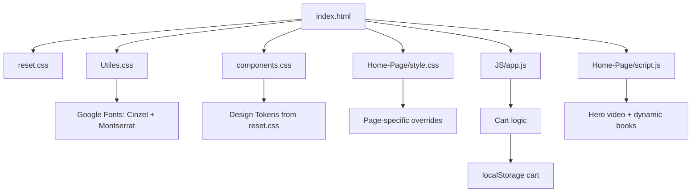

<p align="center">
  
</p>

<p align="center">
  
  
  
  
  
  
  
  
</p>

---

<div align="center">
  
  <h2>🏛️ A Beaux-Arts Digital Bookstore</h2>
  <p><em>Where classical architecture meets modern commerce</em></p>
  
  
  
</div>

---

## ✨ Features

<table>
<tr>
<td width="50%" valign="top">

### 🎨 **Design System**
- **Beaux-Arts Architecture** inspired palette
- **Cinzel** (headings) + **Montserrat** (body) typography
- **Bronze** (`#9A8362`) primary accent
- **Stone** (`#F8F8F6`) warm background
- **Iron** (`#2C2C2C`) primary text
- **Marble** (`#FFFFFF`) card surfaces

### 🏗️ **Architecture**
- Zero-build static site
- ES Modules for JavaScript
- Bootstrap 5.2 + custom CSS
- CSS Custom Properties (design tokens)
- Mobile-first responsive design

</td>
<td width="50%" valign="top">

### 🛍️ **E-Commerce**
- Dynamic book catalog (JSON-driven)
- Category filtering (Philosophy, Novels, Self-Dev, etc.)
- Shopping cart with localStorage persistence
- Checkout form with validation
- Bronze-themed CTAs & ghost buttons

### 🎬 **Media**
- Full-screen library video hero
- Bronze dust particle overlays
- Poster fallback for video
- Responsive carousel components

</td>
</tr>
</table>

---

## 🎨 Color Palette

<div align="center">

| Token | Hex | Preview | Usage |
|-------|-----|---------|-------|
| `--stone-bg` | `#F8F8F6` |  | Page background |
| `--marble-surface` | `#FFFFFF` |  | Cards, modals, inputs |
| `--iron-text` | `#2C2C2C` |  | Primary text, headings |
| `--slate-muted` | `#6B6B6B` |  | Secondary text |
| `--bronze-accent` | `#9A8362` |  | Primary buttons, borders |
| `--bronze-hover` | `#7D694E` |  | Hover states |
| `--bronze-light` | `#C0AE93` |  | Metallic gradients |
| `--border-stone` | `#E0DDD5` |  | Hairline borders |

</div>

---

## 🔤 Typography

<div align="center">

| Element | Font | Weight | Transform | Letter-Spacing |
|---------|------|--------|-----------|----------------|
| **Headings (H1-H6)** | Cinzel | 400 / 600 | Uppercase | 0.12–0.28em |
| **Body Text** | Montserrat | 300 / 400 / 500 | — | Normal |
| **Buttons / UI** | Montserrat | 500 | Uppercase | 0.1–0.18em |
| **Nav Links** | Montserrat | 400 | Uppercase | 0.22–0.28em |

</div>

---

## 🏗️ Architecture



---

## 🚀 Quick Start

```bash
# Clone the repository
git clone https://github.com/deven-deshmukh/BookTown.git
cd BookTown

# Start development server
python -m http.server 8123
# or
npx http-server -p 8123
# or
php -S 127.0.0.1:8123

# Open in browser
open http://127.0.0.1:8123/Home-Page/index.html
```

<details>
<summary><b>📦 Alternative: Using Docker</b></summary>

```dockerfile
FROM nginx:alpine
COPY . /usr/share/nginx/html
EXPOSE 80
```
```bash
docker build -t booktown .
docker run -p 8080:80 booktown
```
</details>

---

## 📁 Project Structure

```
BookTown/
├── 📁 CSS/
│   ├── reset.css           # Design tokens + CSS reset
│   ├── Utiles.css          # Font imports, utilities (fs-*, fw-*)
│   ├── components.css      # Beaux-Arts theme layer
│   └── responsive.css      # (empty - reserved)
├── 📁 Home-Page/
│   ├── index.html          # Homepage with video hero
│   ├── style.css           # Hero, carousels, footer
│   └── script.js           # Dynamic book rendering
├── 📁 ProductsPage/
│   ├── style.css           # Card padding, cart badge
│   ├── defaultScript.js    # Category filtering, sorting
│   ├── cartHandler.js      # Cart count sync
│   ├── MainPage/index.html # Main catalog page
│   └── LinkedHTMLs/        # Category pages (5×)
├── 📁 Cart/
│   ├── index.html          # Cart page with modal checkout
│   ├── style.css           # Modal heights
│   └── script.js           # Cart rendering, qty controls
├── 📁 PaymentPage/
│   ├── index.html          # Checkout form
│   └── style.css           # Form styling, bronze focus
├── 📁 SignUpModal/
│   ├── index.html          # Signup form
│   └── script.js           # Form validation
├── 📁 DataBase/
│   ├── Data.js             # Book catalog + star ratings
│   └── index.html          # Dev sandbox
├── 📁 JS/
│   ├── app.js              # Cart persistence
│   └── biList.js           # Mobile menu toggle
├── 📁 IMG/
│   ├── 📁 books/           # Book cover images
│   ├── 📁 deafults/        # UI images (logo, backgrounds)
│   └── 📁 video/           # Hero video (library.mp4)
├── 404.html                # Custom 404 page
├── package.json            # NPM scripts
├── stylelint.config.json   # CSS linting config
├── CHANGELOG.md            # Version history
├── CONTRIBUTING.md         # Contribution guidelines
├── LICENSE                 # MIT License
└── README.md               # This file
```

---

## 🎬 Hero Video

The hero section features a full-screen **library video background** with:
- **Autoplay + mute + loop** for seamless ambiance
- **Bronze dust particle overlay** (CSS radial gradients)
- **Bronze-tinted gradient overlays** for text legibility
- **Poster fallback** (bookcase image) for loading states
- **Controls enabled** for accessibility

```html
<video class="hero-video" 
       autoplay muted loop playsinline 
       preload="auto" 
       poster="../IMG/deafults/bookcase-img.jpg.jpg">
  <source src="../IMG/video/library.mp4" type="video/mp4">
</video>
```

**Video specs:** H.264 (libx264), 848×478, 24fps, 1.4MB, `-movflags +faststart` for streaming.

---

## 🎯 Interactive Components

<details>
<summary><b>🎭 Nav Bar — Ralph Lauren Style</b></summary>

- Centered, transparent links with animated bronze underline
- Hairline top/bottom borders (`--border-stone`)
- Generous letter-spacing (0.22em), small-caps aesthetic
- Mobile: full-screen overlay with staggered dividers
</details>

<details>
<summary><b>📚 Book Cards — Pedestal Design</b></summary>

- Marble surface, 1px bronze border, sharp corners
- Pedestal shadow: `0 10px 20px rgba(0,0,0,0.05)`
- Generous padding (3rem vertical, 1.8rem horizontal)
- Bronze star ratings, ghost "Add to Cart" buttons
</details>

<details>
<summary><b>🛒 Cart & Checkout</b></summary>

- localStorage persistence across sessions
- Quantity +/- controls with live total
- Discount code input (1-70% range)
- Bronze-styled checkout form with icon-adorned inputs
</details>

---

## 🧪 Development

```bash
# Lint CSS
npx stylelint "CSS/**/*.css" "Home-Page/*.css" "ProductsPage/**/*.css"

# Format check (if prettier configured)
npx prettier --check .

# Run local server with live reload
npx http-server -p 8123 -c-1
```

### Code Style
- **BEM-ish** class naming (`.thumb-wrapper`, `.thumb-content`, `.nav-link-beaux`)
- **CSS Custom Properties** for all colors/spacing
- **Mobile-first** media queries in `components.css`
- **ES Modules** for JS (`type="module"`)

---

## 🤝 Contributing

We welcome contributions! Please see [CONTRIBUTING.md](CONTRIBUTING.md) for details.

```bash
# 1. Fork & clone
git clone https://github.com/YOUR_USERNAME/BookTown.git

# 2. Create feature branch
git checkout -b feature/amazing-feature

# 3. Make changes, commit semantically
git commit -m "feat: add amazing feature"

# 4. Push & open PR
git push origin feature/amazing-feature
```

### Commit Convention
| Type | Example |
|------|---------|
| `feat:` | `feat: add library video hero` |
| `fix:` | `fix: cart count sync on mobile` |
| `style:` | `style: adjust bronze hover opacity` |
| `refactor:` | `refactor: extract card component` |
| `docs:` | `docs: update README with palette` |
| `chore:` | `chore: update .gitignore` |

---

## 📄 License

Distributed under the **MIT License**. See [LICENSE](LICENSE) for more information.

---

## 🙏 Acknowledgments

- **Cinzel** by Natanael Gama — Classical serif inspired by Roman inscriptions
- **Montserrat** by Julieta Ulanovsky — Geometric sans-serif for modern readability
- **Bootstrap Icons** — Clean, consistent iconography
- **Unsplash / WallpaperAccess** — Placeholder photography
- **Beaux-Arts Architecture** — Design inspiration

---

<div align="center">

### 🌟 Star this repo if you found it inspiring!

<p>
  <a href="https://github.com/deven-deshmukh/BookTown/stargazers">
    
  </a>
  <a href="https://github.com/deven-deshmukh/BookTown/forks">
    
  </a>
  <a href="https://github.com/deven-deshmukh/BookTown/watchers">
    
  </a>
</p>

<p><em>Built with ❤️ and a touch of bronze.</em></p>

</div>